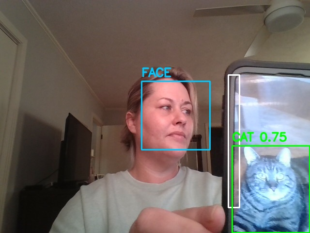

# Camera Face & Cat Detection

This is a personal computer vision project built with Python that uses a webcam to detect faces, motion, and cats in real time.

If a cat is detected walking across the computer, the application automatically locks the keyboard by locking the Windows workstation.

This started as a fun idea and turned into a project I really enjoyed building, with a lot of help from ChatGPT along the way.


## Why this project
I wanted to build something fun and practical while getting more hands-on with computer vision. I get multiple “catwalks” across my computer every day, so this felt like a very real problem to solve. Ironically, while I was building and testing this, the cats were fast asleep and completely uninterested in participating.

It ended up being a great excuse to experiment with real-time detection using a webcam and to learn more about motion gating and object detection in a way that felt approachable and useful.

## What it does
- Opens a live webcam feed
- Detects faces in real time
- Uses motion detection to gate heavier processing
- Detects cats using a YOLO object detection model
- Saves a snapshot when a cat is detected
- Automatically locks the computer to prevent keyboard chaos

## Demo

### Face and cat detection running together


### Cat detected triggering lock


## Tech used
- Python
- OpenCV
- YOLO (Ultralytics)
- Haar Cascades for face detection

## Notes
- The virtual environment and model weights are intentionally not tracked.
- Captured images are ignored by git and saved locally at runtime.
- Detection thresholds and cooldowns can be adjusted in the script.

## Safety
- The keyboard lock uses the standard Windows lock screen (same as pressing Win + L).
- No input devices are disabled at the system level.
- The application can be exited at any time by pressing `q`.

## How to run
```
python -m venv venv
source venv/Scripts/activate
pip install -r requirements.txt
python src/face_and_cat_guard.py
```

## Why this project
I wanted to build something fun and practical while getting more hands-on with computer vision. This project was a way to experiment with real-time detection using a webcam, and it turned into a great excuse to explore motion gating and object detection in a way that felt approachable and useful.
